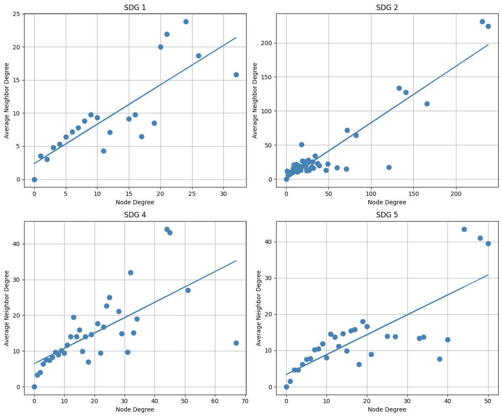
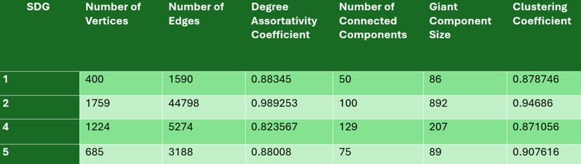

# Co-authorship Network Analysis of UFRN Articles on SDGs

This repository contains the project for the second unit of the Data Structures II course from the Department of Computer Engineering and Automation (DCA) at the Federal University of Rio Grande do Norte (UFRN). The project focuses on analyzing co-authorship of articles related to four Sustainable Development Goals (SDGs) in the SCOPUS database.

## Selected SDGs

The four selected SDGs for this project are:

- SDG 1 - No Poverty
- SDG 2 - Zero Hunger
- SDG 4 - Quality Education
- SDG 5 - Gender Equality
## Project Objectives

1. Article Filtering: Filter all UFRN articles related to the chosen SDGs in the SCOPUS database.
2. Dataframes: Create a dataframe for each SDG containing the filtered articles.
3. Co-authorship Graphs: Construct a co-authorship graph for each SDG, where each vertex represents an author and contains the following information:
- SCOPUS ID
- Author's name
- Affiliation (institution, e.g., UFRN, UFPB, Petrobras, etc.)
4. Assortativity Analysis: Generate bipartite graphs for each network/SDG on the assortativity regarding the degree of the nodes. In the graphs:
- X-axis: Node degree
- Y-axis: Average degree of the node's neighbors
5. Summary Table: Create a table containing the data of each graph.

## Output analysis

<figure>
  
  <figcaption>Figure 1: Bipartite graphs for each network/SDG on the assortativity regarding the degree of the nodes.</figcaption>
</figure>
 
 

In the graph above, you can see a relationship between the degree of a given node and the average degree of all its respective neighbors. All graphs have a straight line with a positive slope, which indicates that, for the most part, a vertex with many neighbors tends to have neighbors that also have many neighbors and vice versa. However, there are exceptions, as can be clearly seen in the SDG 4 graph, where there are points that are quite displaced from the straight line, showing that there are cases in which a node can have several neighbors and its neighbors may not have as many neighbors.

<figure>
  
  <figcaption>Figure 2: Table containing the data of each graph.</figcaption>
</figure>
 
 

It can be seen in the table above that all SDGs presented a similar Degree Assortativity Coefficient and Clustering Coefficient. The high Degree Assortativity Coefficient indicates that authors in the network tend to connect with other authors who have a similar number of collaborations. This behavior suggests the formation of elite groups where prolific authors prefer to collaborate with each other, while authors with fewer collaborations do the same. The high Clustering Coefficient demonstrates that these groups are strongly internally connected, forming cliques or well-defined subcommunities.

## License
This project is licensed under the MIT License. See the LICENSE file for details ([MIT](https://choosealicense.com/licenses/mit/)).

## 🔗 Links
[Youtube](https://www.youtube.com/)

## References

 - [SCOPUS database](https://www.scopus.com/search/form.uri?display=basic#basic)
 - [NetworkX library documentation](https://networkx.org/)
 

## 🚀 About me
If you have any questions or suggestions, please contact me.

Author: Josué Anuar Costa de Medeiros
Contact: josueanuarm@gmail.com
